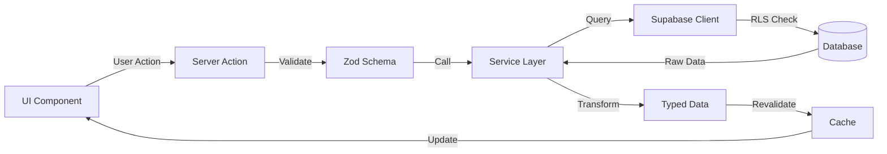

<div align="center">

# 🚗 NJXControl

### Plataforma Integral de Gestión de Playas de Estacionamiento

[](https://nextjs.org/)
[](https://react.dev/)
[](https://www.typescriptlang.org/)
[](https://tailwindcss.com/)
[](https://supabase.com/)

**NJXControl** revoluciona la gestión de estacionamientos urbanos, conectando conductores que buscan dónde estacionar con dueños que quieren optimizar la rentabilidad de sus playas.

[📚 Documentación](./docs) · [🐛 Reportar Bug](../../issues) · [✨ Solicitar Feature](../../issues)

</div>

---

## ✨ Características Principales

<table>
<tr>
<td width="50%">

### 👥 Para Conductores

🗺️ **Búsqueda Inteligente**  
Encuentra playas cercanas con geolocalización automática

📍 **Mapa Interactivo**  
Visualiza ubicaciones en tiempo real con Google Maps

🔍 **Búsqueda Avanzada**  
Autocompletado de direcciones usando Google Places API

⏰ **Información Actualizada**  
Horarios, disponibilidad y tarifas al instante

</td>
<td width="50%">

### 🏢 Para Dueños de Playas

📊 **Panel Administrativo**  
Gestión completa de playas, plazas y empleados

💰 **Gestión de Tarifas**  
Optimización según demanda y horarios pico

📈 **Analytics en Tiempo Real**  
Métricas de ocupación y rentabilidad

👥 **Control de Acceso**  
Sistema de roles y permisos granular

</td>
</tr>
</table>

## 🛠️ Stack Tecnológico

<details open>
<summary><b>🎨 Frontend</b></summary>

- **Framework**: [Next.js 15](https://nextjs.org/) con App Router
- **UI Library**: [React 19](https://react.dev/) con TypeScript
- **Estilos**: [Tailwind CSS 4](https://tailwindcss.com/) + [Radix UI](https://www.radix-ui.com/)
- **Formularios**: [React Hook Form](https://react-hook-form.com/) + [Zod](https://zod.dev/)
- **State Management**: [Zustand](https://zustand-demo.pmnd.rs/) + [TanStack Query](https://tanstack.com/query)
- **Animaciones**: [next-view-transitions](https://github.com/shuding/next-view-transitions)
- **Temas**: [next-themes](https://github.com/pacocoursey/next-themes) con modo oscuro

</details>

<details>
<summary><b>⚙️ Backend & Database</b></summary>

- **BaaS**: [Supabase](https://supabase.com/) (PostgreSQL + Auth + Storage)
- **ORM**: Supabase Client con tipado TypeScript
- **Authentication**: Supabase Auth con JWT
- **Storage**: Supabase Storage para archivos
- **Migrations**: 91 migraciones sincronizadas con RLS

</details>

<details>
<summary><b>🗺️ Servicios Externos</b></summary>

- **Mapas**: [Google Maps Platform](https://developers.google.com/maps)
  - Places API (Autocompletado)
  - Geocoding API (Coordenadas)
  - Maps JavaScript API (Visualización)
- **Emails**: [Resend](https://resend.com/) con templates React
- **Hosting**: [Vercel](https://vercel.com/) con Edge Functions

</details>

<details>
<summary><b>🔧 Desarrollo</b></summary>

- **Package Manager**: pnpm 10.20.0
- **Linting**: ESLint 9 + Prettier
- **Type Checking**: TypeScript 5.9 strict mode
- **Git Hooks**: Husky + lint-staged
- **Testing**: Vitest + Testing Library
- **CI/CD**: GitHub Actions + Vercel

</details>

## 🚀 Quick Start

### Prerrequisitos

Asegúrate de tener instalado:

- **Node.js** ≥ 18.18 ([Descargar](https://nodejs.org/))
- **pnpm** ≥ 8.0 (Instalar: `npm install -g pnpm`)
- **Git** ([Descargar](https://git-scm.com/))

### Instalación en 3 Pasos

```bash
# 1️⃣ Clonar el repositorio
git clone https://github.com/tu-usuario/njxcontrol.git
cd njxcontrol

# 2️⃣ Instalar dependencias
pnpm install

# 3️⃣ Configurar variables de entorno
cp .env.example .env.local
```

### 📋 Configuración de Variables de Entorno

> ⚠️ **Importante:** Solicita las credenciales al administrador del proyecto

Edita `.env.local` con tus credenciales:

```env
# 🔐 Supabase (Backend & Database)
NEXT_PUBLIC_SUPABASE_URL=https://tu-proyecto.supabase.co
NEXT_PUBLIC_SUPABASE_ANON_KEY=tu_anon_key
SUPABASE_SERVICE_ROLE_KEY=tu_service_role_key

# 🗺️ Google Maps Platform
NEXT_PUBLIC_GOOGLE_MAPS_API_KEY=tu_google_maps_key

# 📧 Resend (Email Service)
RESEND_API_KEY=re_tu_resend_key
RESEND_FROM_EMAIL=NJXControl <noreply@tudominio.com>

# 🌐 App Configuration
NEXT_PUBLIC_APP_URL=http://localhost:3000
```

### 🗄️ Setup de Base de Datos

```bash
# Opción 1: Setup automático (recomendado)
pnpm db:setup

# Opción 2: Paso a paso
pnpm db:migrate    # Aplicar migraciones
pnpm db:seed       # Insertar datos de prueba
```

### 🎬 Ejecutar en Desarrollo

```bash
pnpm dev
```

Abre [http://localhost:3000](http://localhost:3000) en tu navegador 🎉

### 👤 Usuarios de Prueba

| Email              | Contraseña | Rol                |
| ------------------ | ---------- | ------------------ |
| `dueno@test.com`   | `test1234` | 🏢 Dueño de Playas |
| `playero@test.com` | `test1234` | 👷 Empleado        |

## 📜 Scripts Disponibles

### 🔨 Desarrollo

```bash
pnpm dev              # Inicia servidor de desarrollo (Turbopack)
pnpm build            # Construye para producción
pnpm start            # Ejecuta build de producción
pnpm typecheck        # Verifica tipos TypeScript
```

### 🧹 Calidad de Código

```bash
pnpm lint             # Ejecuta ESLint
pnpm format           # Formatea código con Prettier
pnpm format:check     # Verifica formato sin modificar
pnpm test             # Ejecuta tests con Vitest
pnpm test:ui          # Abre UI de Vitest
```

### 🗄️ Base de Datos

```bash
pnpm db:info          # Ver información del ambiente
pnpm db:status        # Estado de migraciones
pnpm db:check         # Verificar migraciones pendientes
pnpm db:migrate       # Aplicar migraciones
pnpm db:seed          # Insertar datos de prueba
pnpm db:setup         # Setup completo (migrar + seed)
pnpm db:reset         # Reset completo de BD
```

### 🎨 Assets

```bash
pnpm assets:icons     # Generar iconos de la app
```

### ⚡ Optimización (Windows)

```bash
pnpm optimize:onedrive   # Optimizar OneDrive para desarrollo
pnpm optimize:defender   # Excluir proyecto de Windows Defender
```

## 📂 Estructura del Proyecto

```
njxcontrol/
├── 📱 src/
│   ├── app/                    # Next.js App Router
│   │   ├── admin/             # 🏢 Panel de administración
│   │   │   ├── playas/        # Gestión de playas
│   │   │   ├── plazas/        # Gestión de plazas
│   │   │   ├── tarifas/       # Gestión de tarifas
│   │   │   ├── playeros/      # Gestión de empleados
│   │   │   ├── abonados/      # Gestión de abonados
│   │   │   └── ...            # Otros módulos
│   │   ├── auth/              # 🔐 Autenticación
│   │   │   ├── login/
│   │   │   ├── signup/
│   │   │   └── complete-registration/
│   │   ├── api/               # 🔌 API Routes
│   │   │   ├── auth/
│   │   │   ├── cron/
│   │   │   └── revalidate/
│   │   └── mapa/              # 🗺️ Mapa público
│   ├── components/            # 🧩 Componentes reutilizables
│   │   ├── ui/               # Sistema de componentes base (Radix)
│   │   ├── layout/           # Header, Sidebar, Breadcrumb
│   │   └── admin/            # Componentes del panel admin
│   ├── lib/                  # 🛠️ Configuraciones
│   │   ├── supabase/         # Cliente de Supabase
│   │   ├── resend/           # Cliente de Resend
│   │   └── utils.ts          # Utilidades generales
│   ├── services/             # 📡 Capa de servicios
│   │   ├── playas/           # CRUD de playas
│   │   ├── plazas/           # CRUD de plazas
│   │   ├── tarifas/          # CRUD de tarifas
│   │   └── ...               # Otros servicios
│   ├── schemas/              # ✅ Validaciones Zod
│   ├── types/                # 📘 Definiciones TypeScript
│   ├── hooks/                # 🪝 Custom hooks
│   │   ├── queries/          # React Query hooks
│   │   └── mutations/        # Mutation hooks
│   ├── contexts/             # 🌐 Context providers
│   ├── stores/               # 💾 Zustand stores
│   ├── constants/            # 🔢 Constantes y enums
│   └── utils/                # 🧰 Funciones utilitarias
├── 🗄️ supabase/
│   ├── migrations/           # Migraciones de BD (91 archivos)
│   ├── templates/            # Templates de emails
│   └── config.toml          # Configuración de Supabase
├── 📜 scripts/               # Scripts de automatización
│   ├── seeds/               # Datos de prueba
│   ├── db-*.sh              # Scripts de BD
│   └── ...
├── 📚 docs/                  # Documentación
│   ├── DEVELOPMENT_GUIDE.md # Guía de desarrollo
│   ├── ARCHITECTURE.md      # Arquitectura del proyecto
│   ├── CODE_CONVENTIONS.md  # Convenciones de código
│   └── ...
└── 🔧 config files
    ├── next.config.ts
    ├── tailwind.config.ts
    ├── eslint.config.mjs
    └── tsconfig.json
```

## 🏗️ Arquitectura

### Patrones de Diseño Implementados

<table>
<tr>
<td width="33%">

**🎯 Server Components First**

Usa React Server Components por defecto, con Client Components solo cuando se necesita interactividad.

</td>
<td width="33%">

**📦 Capa de Servicios**

Separación clara entre lógica de negocio (servicios) y presentación (componentes).

</td>
<td width="33%">

**🔄 Server Actions**

Usa Server Actions para mutaciones, con validación Zod en servidor.

</td>
</tr>
<tr>
<td>

**🗂️ Modular por Feature**

Cada módulo (playas, plazas, etc.) tiene su propia estructura autocontenida.

</td>
<td>

**🎨 Design System**

Sistema de componentes basado en Radix UI con variantes predefinidas.

</td>
<td>

**🔐 RLS en Database**

Row Level Security para control de acceso a nivel de base de datos.

</td>
</tr>
</table>

### Flujo de Datos



### Consulta la Documentación Completa

- 📖 [Guía de Desarrollo](./docs/DEVELOPMENT_GUIDE.md) - Patrones y mejores prácticas
- 🏛️ [Arquitectura](./docs/ARCHITECTURE.md) - Estructura del proyecto
- 📝 [Convenciones](./docs/CODE_CONVENTIONS.md) - Estándares de código

## 🚀 Deployment

### Vercel (Recomendado)

[](https://vercel.com/new/clone?repository-url=https://github.com/tu-usuario/njxcontrol)

#### Configuración en 3 Pasos

1. **Conecta tu repositorio** en Vercel

2. **Configura variables de entorno** (copia desde `.env.local`):

   ```env
   NEXT_PUBLIC_SUPABASE_URL=...
   NEXT_PUBLIC_SUPABASE_ANON_KEY=...
   SUPABASE_SERVICE_ROLE_KEY=...
   NEXT_PUBLIC_GOOGLE_MAPS_API_KEY=...
   RESEND_API_KEY=...
   RESEND_FROM_EMAIL=...
   ```

3. **Variables adicionales para migraciones automáticas**:
   ```env
   SUPABASE_ACCESS_TOKEN=...     # Desde: https://app.supabase.com/account/tokens
   SUPABASE_DB_PASSWORD=...      # Desde: Project Settings → Database
   ```

> 💡 Las migraciones se ejecutan automáticamente en cada deployment

#### Verificar Deployment

```bash
# Ver logs de build
vercel logs [deployment-url]

# Verificar migraciones aplicadas
pnpm db:status
```

### Otros Proveedores

<details>
<summary>Netlify</summary>

1. Configura las mismas variables de entorno
2. Build command: `pnpm build`
3. Output directory: `.next`

</details>

<details>
<summary>Self-Hosted (Docker)</summary>

```bash
# Build de la imagen
docker build -t njxcontrol .

# Ejecutar contenedor
docker run -p 3000:3000 --env-file .env.local njxcontrol
```

</details>

## 🤝 Contribución

¡Las contribuciones son bienvenidas! Sigue estos pasos:

### Proceso de Contribución

1. **Fork** el proyecto
2. **Crea una rama** para tu feature
   ```bash
   git checkout -b feature/nueva-caracteristica
   ```
3. **Haz commit** de tus cambios (usa [Conventional Commits](https://www.conventionalcommits.org/))
   ```bash
   git commit -m "feat: agregar nueva característica"
   ```
4. **Push** a tu rama
   ```bash
   git push origin feature/nueva-caracteristica
   ```
5. **Abre un Pull Request**

### Conventional Commits

Usamos Conventional Commits para mensajes claros y changelog automático:

- `feat:` Nueva funcionalidad
- `fix:` Corrección de bug
- `docs:` Cambios en documentación
- `style:` Formato (no afecta código)
- `refactor:` Refactorización de código
- `test:` Agregar o modificar tests
- `chore:` Tareas de mantenimiento

### Estándares de Código

Antes de crear un PR, asegúrate de:

- ✅ Ejecutar `pnpm lint` sin errores
- ✅ Ejecutar `pnpm typecheck` sin errores
- ✅ Ejecutar `pnpm format` para formatear código
- ✅ Escribir tests para nuevas features
- ✅ Actualizar documentación si es necesario
- ✅ Seguir las [convenciones de código](./docs/CODE_CONVENTIONS.md)

### Git Hooks

El proyecto usa Husky para ejecutar automáticamente:

- **pre-commit**: Lint y format en archivos modificados
- **pre-push**: Type checking completo

---

## 📚 Documentación

La documentación completa está disponible en la carpeta [`docs/`](./docs):

| Documento                                            | Descripción                               |
| ---------------------------------------------------- | ----------------------------------------- |
| 🚀 [Quick Start](./docs/QUICK_START.md)              | Setup inicial para nuevos desarrolladores |
| 🏗️ [Arquitectura](./docs/ARCHITECTURE.md)            | Estructura y patrones de diseño           |
| 📝 [Convenciones](./docs/CODE_CONVENTIONS.md)        | Estilo de código y nomenclatura           |
| 🗄️ [Base de Datos](./docs/DATABASE.md)               | Schema y gestión de la BD                 |
| 🔐 [RLS y Vistas](./docs/RLS_VIEWS.md)               | Políticas de seguridad                    |
| 🔄 [Workflow](./docs/WORKFLOW.md)                    | Git Flow y proceso de contribución        |
| 🧪 [Testing](./docs/DEVELOPMENT.md)                  | Usuarios de prueba y debugging            |
| 🚀 [Deployment](./docs/DEPLOYMENT.md)                | Configuración de producción               |
| 📘 [Guía de Desarrollo](./docs/DEVELOPMENT_GUIDE.md) | Patrones y mejores prácticas              |

---

## 🔐 Seguridad

### Autenticación y Autorización

- 🔒 **Supabase Auth**: JWT tokens con refresh automático
- 👤 **Roles de usuario**: DUENO, PLAYERO, ADMIN
- 🛡️ **RLS (Row Level Security)**: Control de acceso a nivel de BD
- 🔑 **Middleware**: Protección de rutas administrativas

### Validación

- ✅ **Zod Schemas**: Validación de formularios en cliente y servidor
- 🔍 **TypeScript**: Tipado estático en toda la aplicación
- 🧹 **Sanitización**: Limpieza de inputs para prevenir XSS

### Reportar Vulnerabilidades

Si encuentras una vulnerabilidad de seguridad, por favor:

1. **NO** abras un issue público
2. Envía un email a: seguridad@njxcontrol.com
3. Incluye detalles del problema y pasos para reproducirlo

---

## 🗺️ Roadmap

### ✅ Completado (v1.0)

- [x] Sistema de autenticación completo
- [x] Panel de administración de playas
- [x] Gestión de plazas y tarifas
- [x] Integración con Google Maps
- [x] Sistema de roles y permisos
- [x] Mapa público de playas

### 🚧 En Progreso (v1.1)

- [ ] Sistema de reservas en tiempo real
- [ ] Panel de analytics avanzado
- [ ] Notificaciones push
- [ ] App móvil (React Native)

### 🔮 Futuro (v2.0)

- [ ] Integración con pagos (Mercado Pago)
- [ ] Sistema de abonos recurrentes
- [ ] API pública para terceros
- [ ] Dashboard de reportes personalizados

---

## 📄 Licencia

Este proyecto está bajo la **Licencia MIT**. Ver el archivo [LICENSE](./LICENSE) para más detalles.

---

## 🆘 Soporte y Comunidad

### ¿Necesitas Ayuda?

- 📖 Revisa la [documentación](./docs)
- 🔍 Busca en [Issues existentes](../../issues)
- 💬 Únete a nuestro [Discord](#) (próximamente)
- 📧 Contacta al equipo: soporte@njxcontrol.com

### Reportar Problemas

Al crear un issue, incluye:

- 📝 Descripción clara del problema
- 🔄 Pasos para reproducir
- 💻 Información del entorno (OS, Node.js version, etc.)
- 📸 Screenshots si es relevante
- 🐛 Logs de error

---

## 🙏 Agradecimientos

### Tecnologías Clave

- [Next.js](https://nextjs.org/) - El framework React para producción
- [Supabase](https://supabase.com/) - Backend as a Service
- [Tailwind CSS](https://tailwindcss.com/) - Framework de CSS utilitario
- [Radix UI](https://www.radix-ui.com/) - Componentes UI accesibles

### Inspiración

Este proyecto fue desarrollado como trabajo final para la **UTN - Universidad Tecnológica Nacional**.

---

## 🔗 Enlaces Útiles

### Documentación Externa

- [Next.js Documentation](https://nextjs.org/docs)
- [React Documentation](https://react.dev/)
- [Supabase Documentation](https://supabase.com/docs)
- [Google Maps Platform](https://developers.google.com/maps)
- [Tailwind CSS](https://tailwindcss.com/docs)
- [TypeScript Handbook](https://www.typescriptlang.org/docs/)

### Herramientas

- [Vercel](https://vercel.com/) - Hosting y deployment
- [Resend](https://resend.com/) - Servicio de emails
- [pnpm](https://pnpm.io/) - Package manager

---

<div align="center">

**Desarrollado con ❤️ para la UTN - Universidad Tecnológica Nacional**

⭐ Si te gusta este proyecto, dale una estrella en GitHub

[⬆ Volver arriba](#-njxcontrol)

</div>
